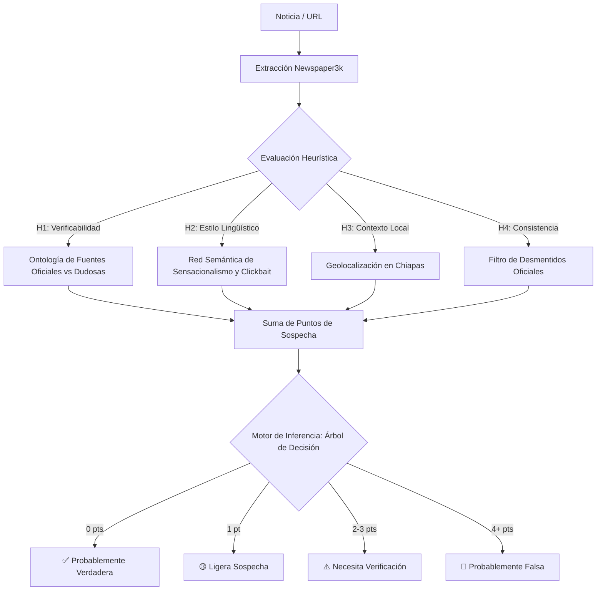

# 🔍 Clasificador Inteligente de Fake News (Heuristic-Based Classifier)
> **Proyecto Académico de Inteligencia Artificial**  

Este proyecto implementa un **Sistema Inteligente de Diagnóstico y Clasificación de Noticias Falsas (Fake News)** enfocado en el contexto del estado de Chiapas, México. El sistema integra técnicas de extracción automatizada de contenido (*Web Scraping*), representación del conocimiento mediante **Ontologías** y **Redes Semánticas**, y un **Motor de Inferencia Heurístico** que recorre un árbol de decisión para clasificar noticias con base en su probabilidad de veracidad.

Posee una **interfaz gráfica de usuario (GUI) moderna y estilizada** con una paleta oscura inspirada en entornos profesionales de desarrollo.

---

## 📸 Interfaz de Usuario (Sleek Dark GUI)

El software cuenta con un diseño de doble panel altamente responsivo y dinámico:
- **Panel Izquierdo (Entrada de Datos):** Captura de URLs, extracción manual y selección de estados de desmentidos oficiales.
- **Panel Derecho (Resultados en Tiempo Real):** Veredicto con códigos de color e iconos, desglose numérico detallado por heurística en una tabla dinámica, y una consola o log interactivo que muestra las trazas del proceso interno de inferencia paso a paso.

---

## ⚙️ Arquitectura del Sistema e Inferencia

El motor del sistema se divide en **4 Pilares Heurísticos** que acumulan *Puntos de Sospecha* cuando detectan anomalías de veracidad:



### 🧪 Los 4 Pilares Heurísticos

1. **Heurística de Verificabilidad (¿Quién lo dice?):** Consulta una **Ontología** interna de dominios de Internet. Las fuentes confiables (ej. `bbc.com`, `eluniversal.com.mx`) suman `0 pts`. Los dominios desconocidos suman `+1 pt` y las redes sociales o blogs de rumores conocidos (ej. `facebook.com`, `whatsapp.com`, `costanews.com`) añaden `+2 pts`.
2. **Heurística de Estilo Lingüístico (¿Cómo lo dice?):** Realiza un análisis léxico-semántico sobre el título de la noticia buscando patrones de *Clickbait*. Evalúa la presencia de palabras en una **Red Semántica de Sensacionalismo** (ej. *mutilaciones, ejecución, urgente, impacto*) y "Gritos Digitales" (títulos con más de un 30% de mayúsculas). Suma `+1 pt` si se cumple alguna regla.
3. **Heurística de Contexto Local (¿Dónde ocurre?):** Compara los tokens del texto contra un listado geográfico de municipios y regiones de Chiapas (ej. *Jiquipilas, Tuxtla, San Cristóbal*). Al combinarse con fuentes de baja credibilidad, incrementa el riesgo de alarmismo local. Suma `+1 pt`.
4. **Heurística de Consistencia (¿Alguien ya lo desmintió?):** Filtro de validación manual contrastado. Si existe un desmentido público por parte de autoridades u organismos de fact-checking debidamente verificado, añade `+2 pts`.

---

## 📊 Reglas de Producción y Toma de Decisiones

El sistema procesa la puntuación total a través de **Reglas de Producción (SI $\rightarrow$ ENTONCES)** para emitir su veredicto formal:

| Puntos de Sospecha | Regla Activada | Veredicto Final | Descripción Lógica |
| :---: | :--- | :--- | :--- |
| **0** | **R3:** Fuente confiable y sin contradicción. | **✅ PROBABLEMENTE VERDADERA** | El medio cuenta con alta credibilidad y el lenguaje es formal y objetivo. |
| **1** | **R0:** Indicadores leves detectados. | **🟡 LIGERA SOSPECHA / NEUTRAL** | Solo un factor leve activa sospecha (ej. portal de noticias local poco conocido sin clickbait). |
| **2 a 3** | **R1:** Múltiples alertas. | **⚠️ NECESITA VERIFICACIÓN** | Acumulación moderada de síntomas de alerta (ej. fuente de red social o título alarmista). |
| **4+** | **R2:** Alertas graves o desmentido. | **🚨 PROBABLEMENTE FALSA** | Alta probabilidad de desinformación, comúnmente confirmada por un desmentido oficial. |

---

## 🛠️ Tecnologías Utilizadas

- **Lenguaje:** [Python 3.8+](https://www.python.org/)
- **Interfaz Gráfica:** `tkinter` + `ttk` (Personalización visual manual de widgets nativos mediante hilos de ejecución concurrentes)
- **Extracción de Contenido:** `newspaper3k` (Procesamiento y descarga asíncrona de páginas web)
- **Procesamiento de Lenguaje:** Librerías internas de limpieza, tokenización y análisis semántico de cadenas.
- **Multihilo:** Módulo `threading` para evitar que la UI se congele durante el scraping y la inferencia asíncrona.

---

## 🚀 Instalación y Uso Rápido

Sigue estos sencillos pasos para poner en marcha el clasificador inteligente en tu máquina local:

### 1. Clonar el repositorio
```bash
git clone https://github.com/Jaime-Ibarr4/FakeNews-InterfazGrafica.git
cd FakeNews-InterfazGrafica
```

### 2. Configurar el Entorno Virtual (Recomendado)
Crea un entorno aislado para proteger tus dependencias globales:

*   **En Windows:**
    ```powershell
    python -m venv venv
    .\venv\Scripts\activate
    ```
*   **En macOS/Linux:**
    ```bash
    python3 -m venv venv
    source venv/bin/activate
    ```

### 3. Instalar Dependencias
Una vez activado el entorno, instala los paquetes requeridos:
```bash
pip install -r requirements.txt
```

### 4. Lanzar la Interfaz Gráfica
Para iniciar el clasificador en modo de escritorio, ejecuta el script principal:
```bash
python interfaz.py
```

---

## 👥 Autores y Créditos

Este prototipo de sistema experto heurístico ha sido diseñado e implementado por:
* **Jaime Ibarr4** - *Desarrollo de Backend, Reglas del Motor de Inferencia e Interfaz Gráfica.*
